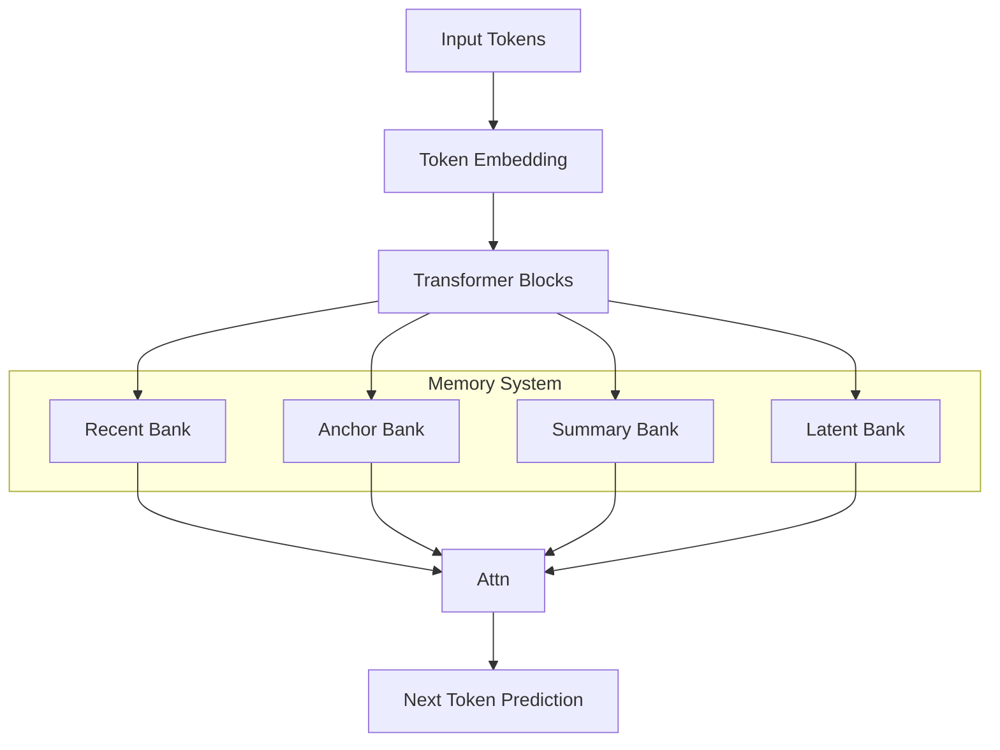

# PRISM-LLM: Prime-Residual Integrated Sparse Memory Transformer

## Abstract

We propose **PRISM-LLM**, a bounded-memory transformer architecture designed to enable long-context reasoning (4k–8k tokens) under strict GPU memory constraints (2–4 GB VRAM). Unlike standard transformers that store full token history, PRISM-LLM introduces a structured memory system combining recent exact tokens, prime-aware sparse anchors, semantic summaries, and latent reconstructive memory. This enables sublinear memory growth while preserving long-range dependencies.

---

## 1. Introduction

Transformer models scale poorly with sequence length due to linear KV-cache growth:

$$
M_{KV} = O(L \cdot T \cdot d)
$$

where:
- $L$ = number of layers
- $T$ = sequence length
- $d$ = hidden dimension

This makes long-context inference impractical on low-memory hardware.

We reformulate the problem as:

$$
\min_{\theta} \mathbb{E}[\mathcal{L}_{LM}] \quad \text{s.t.} \quad C(\mathcal{M}) \leq B
$$

where:
- $\mathcal{M}$ = compressed memory
- $B$ = memory budget

---

## 2. Core Idea

Instead of storing all tokens, PRISM-LLM stores structured memory:

$$
\mathcal{M} = \mathcal{R} \cup \mathcal{A} \cup \mathcal{S} \cup \mathcal{Z}
$$

| Component | Description |
|----------|------------|
| $\mathcal{R}$ | Recent exact tokens |
| $\mathcal{A}$ | Prime-aware anchors |
| $\mathcal{S}$ | Semantic summaries |
| $\mathcal{Z}$ | Latent reconstructive memory |

---

## 3. Architecture Overview

---

## 4. Attention Mechanism

At timestep $t$, attention is computed as:

$$
y_t = g_r A_R + g_a A_A + g_s A_S + g_z A_Z
$$

where:

$$
[g_r, g_a, g_s, g_z] = \text{softmax}(W_g h_t)
$$

Each term corresponds to attention over a memory bank.

---

## 5. Prime-Aware Anchoring

We introduce prime-based positional features:

$$
\Pi(i) = [\cos(2\pi i/p_1), \sin(2\pi i/p_1), ..., \cos(2\pi i/p_n)]
$$

Anchor score:

$$
a_i = w^T h_i + v^T \Pi(i)
$$

Retention probability:

$$
\rho_i = \sigma(a_i)
$$

This reduces periodic aliasing and improves long-range stability.

---

## 6. Semantic Summarization

For chunk $S_j$:

$$
s_j = \sum_{i \in S_j} \alpha_{ji} h_i
$$

where:

$$
\alpha_{ji} = \frac{\exp(u^T h_i)}{\sum_k \exp(u^T h_k)}
$$

---

## 7. Latent Memory

Older tokens are encoded into latent representations:

$$
z_j = f_{enc}(H_{S_j})
$$

Reconstructed at query time:

$$
\hat{k}_j = g_k(z_j, q_t), \quad \hat{v}_j = g_v(z_j, q_t)
$$

---

## 8. Complexity

Standard transformer:

$$
O(LTd)
$$

PRISM-LLM:

$$
O(L(R + A + S + Z)d)
$$

with:

$$
R + A + S + Z << T
$$

---

## 9. Training Objective

$$
\mathcal{L} = \mathcal{L}_{CE} + \mathcal{L}_{KD} + \mathcal{L}_{hidden} + \mathcal{L}_{attn} + \mathcal{L}_{memory}
$$

---

## 10. Knowledge Distillation

We align student with teacher:

$$
\mathcal{L}_{KD} = KL(p_t^{teacher} || p_t^{student})
$$

Hidden matching:

$$
\mathcal{L}_{hidden} = ||h_s - h_t||^2
$$

---

## 11. Experimental Plan

- Baseline dense model
- PRISM memory ablations
- Anchor vs no-anchor
- Summary vs no-summary
- Latent vs no-latent

Metrics:
- Perplexity
- Long-context retrieval
- Memory usage

---

## 12. Related Work

- Vaswani et al., 2017 — Attention is All You Need
- Dai et al., 2019 — Transformer-XL
- Rae et al., 2020 — Compressive Transformer
- Beltagy et al., 2020 — Longformer
- Dao et al., 2022 — FlashAttention

---

## 13. Contributions

1. Prime-aware sparse memory
2. Multi-bank bounded memory architecture
3. Latent reconstructive KV compression
4. KD-based compressed training

---

## 14. Future Work

- Learned prime distributions
- Hardware-aware scheduling
- Multimodal memory

---

## Conclusion

PRISM-LLM redefines transformer memory by shifting from full retention to structured compression. It enables long-context reasoning on resource-constrained hardware while maintaining performance.

